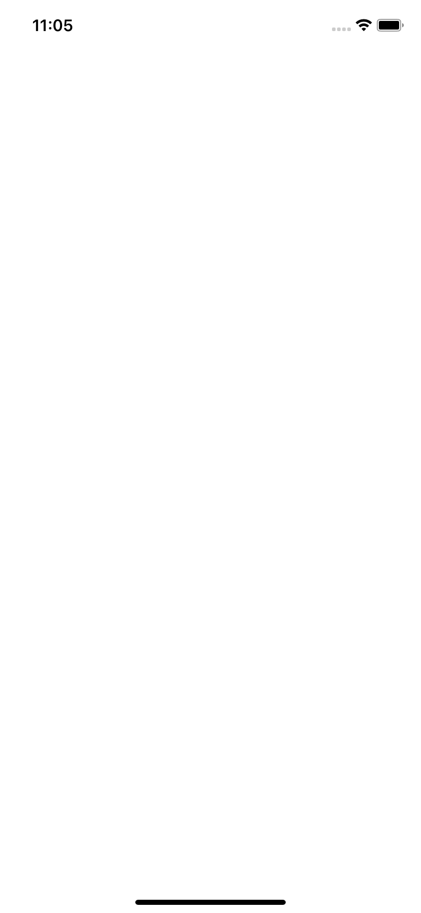
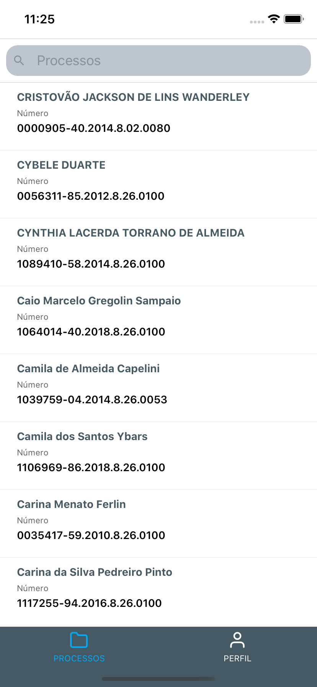
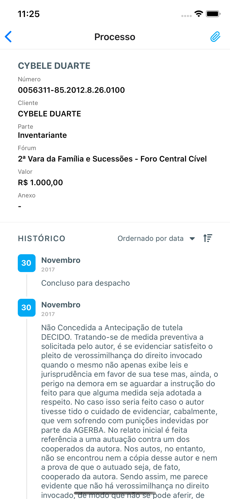
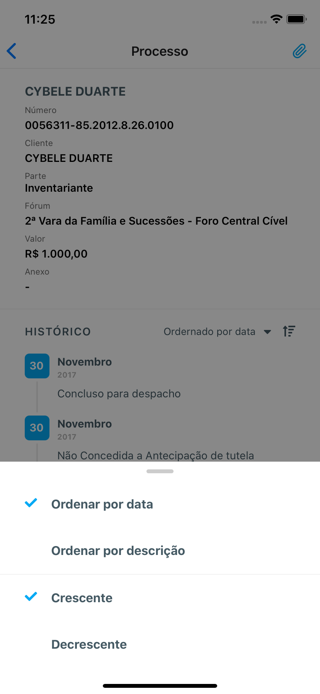
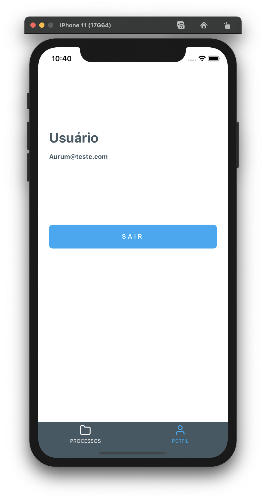

# Pokedex - React Native
> [WIP] Aurumtest build in React Native, redux, redux-saga and redux-persist.

> [WIP] Aurumtest desenvolvida em React Native, redux, redux-saga e redux-persist.


<div align="center" styles="flex-direction: row;">
  
</div>
<div align="center" styles="flex-direction: row;">
  
  
  
  
 </div>

## Installation

- Clone repo: git clone https://github.com/maycooliveira/aurum.git
- Install dependencies: `yarn` or `npm install
  
```sh
expo start
```
  
## Release History

* 0.0.1
    * Work in progress
    
## Meta

Mayco – maycoasamoda@hotmail.com

Distributed under the MIT license. See ``LICENSE`` for more information.
    
## Contributing

1. Fork it (<https://github.com/maycooliveira/aurum>)
2. Create your feature branch (`git checkout -b feature/fooBar`)
3. Commit your changes (`git commit -am 'Add some fooBar'`)
4. Push to the branch (`git push origin feature/fooBar`)
5. Create a new Pull Request
    
 
